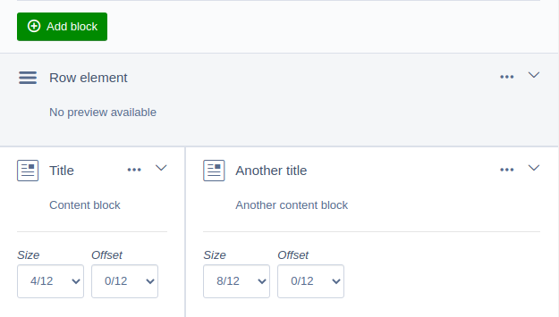

# SilverStripe Elemental Grid

## Introduction

This module converts the elemental module (https://github.com/dnadesign/silverstripe-elemental) into a grid module



## Requirements

* SilverStripe CMS ^4.0
* dnadesign/silverstripe-elemental dev-master
* Frontend css supporting a bootstrap style grid system (col-xs-X col-sm-X col-md-X col-lg-X visible-XS/SM/MD/LG hidden-XS/SM/MD/LG and col-xs-offset-X etc)

## Installation

```
composer require "thewebmen/silverstripe-elemental-grid" "dev-master"
```

After that follow the steps from the elemental documentation installation section after the composer require: https://github.com/dnadesign/silverstripe-elemental

## Settings
```
TheWebmen\ElementalGrid:
  defaultSizeField: 'MD' (xs, sm, md, lg)
  defaultOffsetField: 'MD' (xs, sm, md, lg)
  cssFramework: 'bootstrap' (bootstrap, bulma)
```

## Add settings to rows
* Add a dataextension to TheWebmen\ElementalGrid\Models\ElementRow
* Copy the template TheWebmen/ElementalGrid/Models/ElementRow.ss to your theme

## Nested rows/grids
To create nested rows or grids you need to create a grid element ss the elemental documentation for more information. 

## Disallow rows
See the elemental documentation: https://github.com/dnadesign/silverstripe-elemental and add TheWebmen\ElementalGrid\Models\ElementRow to the disallowed_elements

## TODO
* Break point switch in grid view (lg,md,sm,xs)
* Upgrade Elemental module
